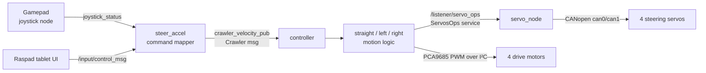

# myROBOT: ROS 2 control stack for a four-wheel-steering crawler

A ROS 2 (Python) package that drives a four-wheeled crawler robot. Each wheel has its own steering servo (on a CANopen bus) and its own drive motor (PWM over I²C), and the robot is controlled from a gamepad or a tablet UI.

## What it does

- **Teleoperation**: a gamepad node reads raw controller events and turns them into one `Crawler` command message (direction, speed, mode, zero-position request). An alternative input node accepts the same commands from a Raspad tablet UI.
- **Four-wheel steering**: front wheels turn one way and rear wheels turn the opposite way, in small angle steps, with soft limits at about ±30°. An auto-correction moves the wheels back to a safe absolute angle when they overshoot.
- **Turn-aware wheel speeds**: on turns, the drive speed of the inner wheels is scaled with the current steering angle, so the crawler turns smoothly instead of scrubbing.
- **Two steering modes**: per-mode servo zero offsets are loaded from `config/sw_profile.yml` and switched at runtime from the controller.
- **Servo service**: one ROS 2 service owns all four CANopen servos and exposes relative and absolute moves plus position read-back. It also disables the servos cleanly on shutdown.

## Architecture



| Node (entry point) | Role |
|---|---|
| `joystick` | Publishes raw gamepad events (using the `inputs` library) |
| `velocity_joy` / `velocity_ras` | Map gamepad or tablet input to a `Crawler` command |
| `controller` | State machine: picks straight, left or right motion from direction and current servo angles |
| `servo_node` | ServosOps service over CANopen (CiA 402 profile-position mode) |
| `leftist`, `rightist`, `strightness` | Motion behaviours, also runnable as standalone nodes |

## Tech stack

ROS 2 (`rclpy`, ament_python) · Python · CANopen (`canopen`, SocketCAN) · Adafruit PCA9685 / Blinka (`busio`, `board`) · PyYAML · NumPy · `inputs` (gamepad)

## Getting started

This package runs on the robot's onboard Linux computer. It needs the real hardware: two SocketCAN interfaces (`can0`, `can1`), a PCA9685 on I²C, and four CANopen servo drives.

It also depends on two companion ROS 2 interface packages that are **not in this repo**:

- `crawler_libs`: defines the `Crawler` message
- `crawler_srv`: defines the `ServosOps` service

```bash
# inside a ROS 2 workspace that also contains crawler_libs and crawler_srv
cd ~/ros2_ws/src
git clone https://github.com/nidhicj/ros2-field-rover.git crawler_ros2
pip install canopen adafruit-circuitpython-pca9685 inputs pyyaml numpy
cd ~/ros2_ws && colcon build --packages-select crawler_ros2
source install/setup.bash

# one terminal per node
ros2 run crawler_ros2 servo_node
ros2 run crawler_ros2 controller
ros2 run crawler_ros2 joystick
ros2 run crawler_ros2 velocity_joy
```

Two paths can be overridden with environment variables:

- `CRAWLER_SW_PROFILE`: steering-profile YAML (defaults to the bundled `config/sw_profile.yml`)
- `SERVO_EDS_PATH`: the servo drive's CANopen EDS file (defaults to `ZeroErr Driver_V1.5.eds` in the working directory)

**Gamepad mapping**: the D-pad X axis steers (left, straight, right); the right stick sets speed; **X** selects mode 1 (wheels offset to 30°); **Y** selects mode 0; **A** returns the servos to their zero positions.

## Project structure

```
crawler_ros2/
  controller/   Top-level state machine node
  motion/       Straight, left, right and parking behaviours
  servos/       CANopen servo setup (ServoConfig) and the ServosOps service node
  wheels/       PCA9685 PWM wheel driver
  ui/           Gamepad and tablet input nodes
  utils/        Service client and YAML config loader
  config/       Per-mode servo zero offsets
test/           ament copyright, flake8 and pep257 checks
```

## Status

This is a prototype. Possible next steps:

- Turn the hard-coded paths and CAN channels into ROS parameters
- Add a launch file
- Publish the interface packages alongside this one
